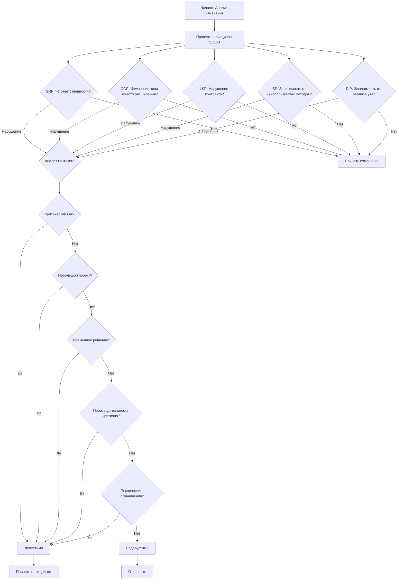

# SOLID Change Validator

The SOLID Change Validator is a C# library that helps developers ensure that code changes adhere to the SOLID principles of object-oriented design. It provides a set of tools to detect violations of the SOLID principles and classify them based on the project context.

## Features

- Detects violations of the following SOLID principles:
  - Single Responsibility Principle (SRP)
  - Open/Closed Principle (OCP)
  - Liskov Substitution Principle (LSP)
  - Interface Segregation Principle (ISP)
  - Dependency Inversion Principle (DIP)
- Classifies violations as "minor" or "critical" based on the project context
- Allows for exceptions to SOLID principles in certain situations (e.g., critical bug fixes, performance-critical changes)
- Provides a clear and concise report of the detected violations

## Usage

To use the SOLID Change Validator, follow these steps:

1. Install the `SolidChangeValidator` package from NuGet.
2. Create an instance of the `SolidChangeValidator` class.
3. Call the `ValidateChange` method, passing in a `CodeChange` object and a `ChangeContext` object.
4. Inspect the `ValidationResult` object to determine the decision (accept, accept with tech debt, accept with refactor, or reject) and the list of violated SOLID principles.

Here's an example:

```csharp
var validator = new SolidChangeValidator();
var change = new CodeChange("CHG-2023-789", "Update documentation");
var context = new ChangeContext();
var result = validator.ValidateChange(change, context);

Console.WriteLine(result.ToString());

```

